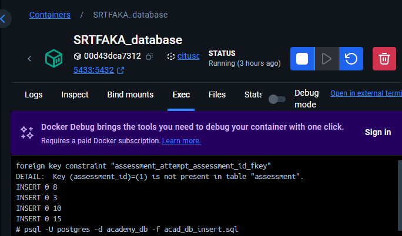

## Project Root
- SRTFAKA folder is the project/package root
- To run any modules within, start from outside the root folder

## Virtual Environment & Dependencies
### Create Virtual Environment
```shell
cd .\SRTFAKA\
python -m venv venv
cd ..
```
### Activate the Virtual Environment
- .\SRTFAKA\myenv\Scripts\activate

### Install Dependencies
```sh
.\myenv\Scripts\activate
pip install -r requirements.txt
```

## Setup Database
### Start up DB Instance
Using the docker-compose.yml file, start the db service.
### Migrating DB Schema
1. Change directory into the backend folder
```
cd SRTFAKA
```
2. Migrate the existing schema into your database
```
alembic upgrade head
```
In case you have issues with your migration, force one by changing the head 
```
alembic stamp head
```

### Importing dummy data into DB
1. Copy the Insertion Script into the Docker container
```
docker cp [Path to your insert script]acad_db_insert.sql [Docker container ID]:/acad_db_insert.sql
```
2. Go to your docker container db terminal and paste the command into it

```
psql -U postgres -d academy_db -f acad_db_insert.sql
``` 

### Migrating Model Changes into the DB
Only do this if you actually changed something in the DB models, remember to update the sql insert script if you change the columns!
1. Generate a migration script based on your NEW model changes

Alembic will recognise the difference between your current DB and the changed model and generate a set of changes.
```
alembic revision --autogenerate -m "Your commit message"
```
2. Migrate the updated schema into your database
```
alembic upgrade head
```
## Execution
### Powershell Script (Option 1)
1. Open a powershell terminal outside the root folder (Outside SRTFAKA)
2. Then, set Execution Policy to RemoteSigned

    ```sh
    Set-ExecutionPolicy RemoteSigned -Scope CurrentUser
    ```
3. Run Powershell script
    ```sh
    .\start.ps1
    ```
4. **Reminder:** Set Execution Policy back to Restricted (When Unused)
    ```sh
    Set-ExecutionPolicy Restricted -Scope CurrentUser
    ```

### Run Individual Modules Manually (Option 2)
#### Run the codes in 2 separate cmd all in virtual environment
- Run as a module from package 
- python -m SRTFAKA.services.accountService.main
- python -m services.courseService.main
- python -m services.assessmentService.main
- python -m services.jobService.main
- python -m services.certificateService.main

#### Run API Gateway in a separate powershell in virtual environment
- uvicorn SRTFAKA.apiGateway.main:app --host 0.0.0.0 --port 80

## GRPC ProtoBuf Generation
From inside the SRTFAKA folder, invoke this code and change trip to whatever you're generating
```sh
python -m grpc_tools.protoc -I protos --python_out=./generated --pyi_out=./generated --grpc_python_out=./generated protos/[service].proto
```
- Ensure that the line in [service]_pb2_grpc.py:

    ```python
    "import [service]_pb2 as [service]__pb2"
    ```
    Change to:
    ```python
     "from . import [service]_pb2 as [service]__pb2"
     ```
## API Routes Documentation
- Located at http://localhost:[port]/docs

## Services
- Sign up (Darren) (AccountService)
- Login (Darren) (AccountService)
- Profile (Mario) (AccountService)
- Courses (Richard) (CoursesService)
- Assessment (Ky) (AssessmentService)
- Certification + blockchain (Kwan) (CertificateService)
- Job application (Joel) (JobService)